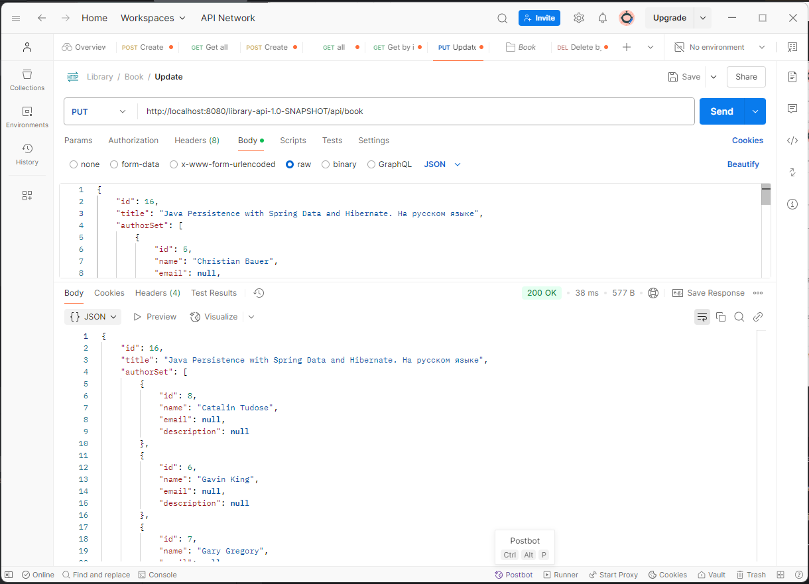
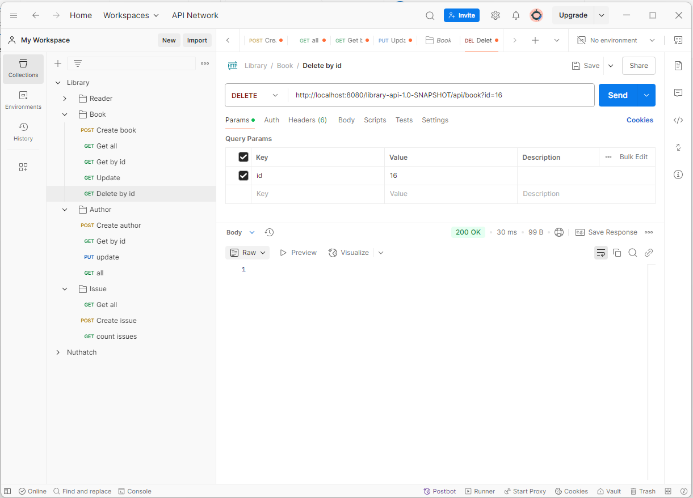

# Автоматизация работы библиотеки
## Реализация

Java(TM) SE Runtime Environment (build 22.0.1+8-16)  
Application server: JBoss/WildFly 35.0.0.Final  
Liquibase version 4.31.0

### Подключенные зависимости

* jakarta.enterprise.cdi-api version 4.1.0
* jakarta.jakartaee-api version 11.0.0-M4
* hibernate-core version 7.0.0.Beta1
* postgresql jdbc driver version 42.7.5
* junit-jupiter-api, mockito-core

#### Подготовка баз данных
Приложение предоставляет возможность для добавления, просмотра, обновления и удаления записей в БД. 
В качестве СУБД принята PostgreSQL v.17.

Для первоначальной настройки выполнен sql-скрипт для создания БД, пользователя БД и определения прав.  

`init.sql`:
```sql
-- Создание library database
-- Предоставление прав для пользователя library_db_user
DO
$$
    DECLARE
        database_name TEXT := 'library_db';
        user_name     TEXT := 'library_user';
    BEGIN
        IF NOT EXISTS (SELECT 1 FROM pg_database WHERE datname = database_name)
        THEN
            PERFORM dblink_exec('dbname=postgres', 'CREATE DATABASE ' || quote_ident(database_name));
            PERFORM dblink_exec('dbname=postgres',
                                'GRANT SELECT, INSERT, UPDATE, DELETE ON DATABASE ' || quote_ident(database_name) ||
                                ' TO ' || quote_ident(user_name));
        END IF;
    END
$$;
```

Дальнейшая работа с миграциями (создание таблиц и т.д.) производится при помощи Liquibase changelog.  
`library_tables.sql`:
```sql
--liquibase formatted sql

--changeset Eugene_Elantsev:1
CREATE TABLE author
(
    id          BIGSERIAL PRIMARY KEY,
    name        VARCHAR(255) NOT NULL,
    email       VARCHAR(100),
    description VARCHAR(255)
);

--changeset Eugene_Elantsev:2
CREATE TABLE book
(
    id                  BIGSERIAL PRIMARY KEY,
    title               VARCHAR(255) NOT NULL,
    date_of_publication DATE,
    page_count          INT,
    description         VARCHAR(255),
    number_of_units     INT
);

...
```
#### Диаграмма БД


#### Настройка источника данных
Для управления сущностями определен Persistent Unit  
`persistence.xml`
```xml
<persistence-unit name="library-persistent-unit" transaction-type="JTA">
    
    <description>Default library management PU</description>

    <provider>org.hibernate.jpa.HibernatePersistenceProvider</provider>
    <jta-data-source>java:/PostgresDS</jta-data-source>

    <class>ru.nuthatch.libraryapi.entity.Author</class>
    <class>ru.nuthatch.libraryapi.entity.Book</class>
    <class>ru.nuthatch.libraryapi.entity.Issue</class>
    <class>ru.nuthatch.libraryapi.entity.Reader</class>
    
</persistence-unit>
```

в котором `java:/PostgresDS` ссылается на источник данных, который был предварительно настроен в 
сервере приложений `WildFly` и поддерживает транзакции JTA:


А также определены классы сущностей для работы.

### Классы сущностей
Для управления записями в БД определены сущности в соответствие с представленной диаграммой БД.
Пример для сущности "Выдача"
`Issue.java`
```java
package ru.nuthatch.libraryapi.entity;

import jakarta.persistence.*;
import lombok.Getter;
import lombok.Setter;

import java.io.Serial;
import java.io.Serializable;
import java.util.Date;

@NamedNativeQuery(name = "Issue.findAll", query = "SELECT i.* FROM issue i", resultClass = Issue.class)

@NamedNativeQuery(name = "Issue.setBookReturnedById",
        query = "UPDATE issue i SET returned_at = :returned_date WHERE id = :issue_id")

@NamedNativeQuery(name = "Issue.findAllIssuesByReaderForPeriod",
        query = "SELECT i.* FROM issue i " +
                "WHERE i.reader_id = :reader_id " +
                "AND i.issued_at BETWEEN :start_date AND :end_date",
        resultClass = Issue.class)

@NamedNativeQuery(name = "Issue.findCountOfIssuesByReaderForPeriod",
        query = "SELECT count(*) FROM issue i " +
                "WHERE i.reader_id = :reader_id " +
                "AND i.issued_at BETWEEN :start_date AND :end_date",
        resultClass = Integer.class)

@Getter
@Setter
@Entity
@Table(name = "issue")
public class Issue implements Serializable {

    @Serial
    private static final long serialVersionUID = 1L;

    @Id
    @GeneratedValue(strategy = GenerationType.IDENTITY)
    @Column(nullable = false, updatable = false)
    private long id;

    @ManyToOne
    private Book book;

    @ManyToOne
    private Reader reader;

    @Column(name = "issued_at", updatable = false)
    private Date issuedAt;

    @Column(name = "returned_at")
    private Date returnedAt;

    @PrePersist
    private void onCreate() {
        issuedAt = new Date();
    }
}
```

### Репозитории
Для каждой хранимой сущности выполнен репозиторий для управления записями. 
Репозиториями определены CRUD методы, а также дополнительные методы для управления выдачами 
(возврат книги, выданные книги для отдельного читателя за определенный период и их количество).  
Дополнительные функции выполнены с помощью именованных запросов.

`IssueRepository.java`:
```java
...

@Transactional
public int setBookReturnedById(long issueId) {
    return entityManager.createNamedQuery("Issue.setBookReturnedById")
            .setParameter("returned_date", new Date())
            .setParameter("issue_id", issueId)
            .executeUpdate();
}

@Transactional
public List<Issue> findAllIssuesByReaderForPeriod(long readerId, Date startDate, Date endDate) {
    return entityManager.createNamedQuery("Issue.findAllIssuesByReaderForPeriod", Issue.class)
            .setParameter("reader_id", readerId)
            .setParameter("start_date", startDate)
            .setParameter("end_date", endDate)
            .getResultList();
}

@Transactional
public int findCountOfIssuesByReaderForPeriod(long readerId, Date startDate, Date endDate) {
    return entityManager.createNamedQuery("Issue.findCountOfIssuesByReaderForPeriod", Integer.class)
            .setParameter("reader_id", readerId)
            .setParameter("start_date", startDate)
            .setParameter("end_date", endDate)
            .getSingleResult();
}

...
```
### Сервисный слой
Исполнением приложения предусмотрен сервисный слой для возможного размещения логики работы. 
Классы именованы как `XXXXService`.

### Контроллеры приложения
Для взаимодействия с API приложения выполнены REST контроллеры, определены методы для создания, 
изменения, получения. Принятие и передача осуществляется в Json-формате.

`IssueResource.java`:
```java
@Stateless
@Path("issue")
@Produces(MediaType.APPLICATION_JSON)
public class IssueResource {

    @Inject
    private IssueService service;

    @POST
    @Consumes(MediaType.APPLICATION_JSON)
    public Response create(Issue issue) {
        return service.create(issue)
                .map(value -> Response
                        .status(Response.Status.CREATED)
                        .entity(value)
                        .build())
                .orElseGet(() -> Response.status(Response.Status.INTERNAL_SERVER_ERROR).build());
    }

    @GET
    public Response findById(@QueryParam(value = "id") long id) {
        return service.findById(id)
                .map(value -> Response
                        .status(Response.Status.OK)
                        .entity(value)
                        .build())
                .orElseGet(() -> Response.status(Response.Status.NOT_FOUND).build());
    }

...
```
## Работа приложения
На примере работы с сущностью `Book`:

* Создание книги


* Получение по id


* Внесение изменений



* Удаление книги


